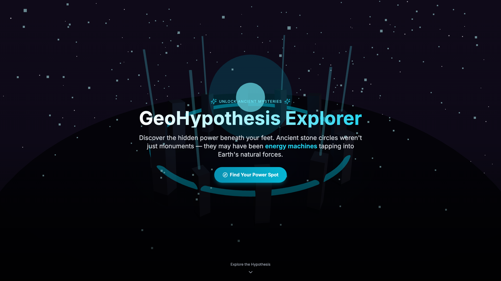
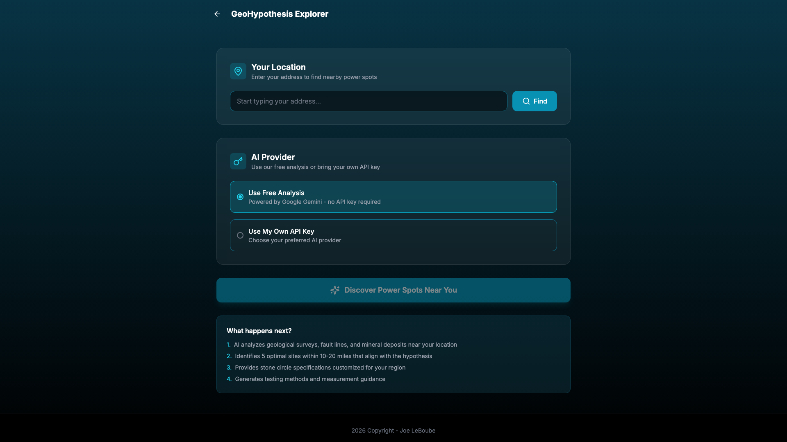

<div align="center">

# GeoHypothesis Explorer


[](https://www.buymeacoffee.com/muscl3n3rd)

An AI-powered web application that helps users discover optimal locations for testing the ancient stone circle hypothesis by analyzing geological data, fault lines, and seismic activity.

[Screenshots](#screenshots) • [Features](#features) • [Quick Start](#quick-start) • [Tech Stack](#tech-stack)

</div>

## Screenshots

GeoHypothesis Explorer Landing Page & Results





## The Hypothesis

Ancient stone circles weren't just monuments—they may have been sophisticated energy machines tapping into Earth's natural forces:

- **Electromagnetic Harvesters**: Stone circles may have captured and concentrated Earth's natural electromagnetic fields through piezoelectric properties of granite and quartz.

- **Consciousness Amplifiers**: These ancient structures could have served as geophysical amplifiers for altered states of consciousness, enhancing meditation and healing.

- **Telluric Conduits**: Positioned at geological fault lines and mineral deposits, stone circles may have acted as conductors for Earth's telluric currents and lightning energy.


## Features

- **Interactive 3D Visualization**: Stunning Three.js-powered stone circle animation on the landing page
- **Google Maps Integration**: Address autocomplete and interactive map display with site markers
- **Geological Overlays**: Real-time fault lines and earthquake data from USGS APIs
- **Multi-Provider AI Support**: Choose from:
  - Google Gemini (default, free)
  - OpenAI (GPT-4)
  - Anthropic (Claude)
  - xAI (Grok)
- **Site Recommendations**: Get 5 optimal locations within 10-20 miles with geological analysis
- **Practical Test Circle Specs**: Portable stone circle designs using manageable stones (under 50 lbs)
- **Testing Guidance**: Equipment lists, procedures, and safety protocols
- **PDF Export**: Download complete analysis with static map image


## Tech Stack

### Frontend
- **Next.js 14** - React framework with App Router
- **React 18** - UI framework
- **TypeScript** - Type safety
- **Tailwind CSS** - Utility-first styling (custom teal/cyan theme)
- **Framer Motion** - Animations

### 3D Graphics
- **Three.js** - 3D rendering engine
- **React Three Fiber** - React renderer for Three.js
- **React Three Drei** - Useful helpers for R3F

### Maps & Geological Data
- **Google Maps JavaScript API** - Interactive maps
- **Google Places API** - Address autocomplete
- **Google Static Maps API** - PDF export maps
- **USGS Earthquake API** - Seismic activity data
- **USGS Fault Database** - Quaternary fault lines

### AI Providers
- **Google Generative AI** - Gemini integration
- **OpenAI API** - GPT-4 integration
- **Anthropic API** - Claude integration
- **xAI API** - Grok integration

### Infrastructure
- **Docker** - Containerization
- **Docker Compose** - Multi-container orchestration


## Quick Start

### Prerequisites
- Docker and Docker Compose v2
- Google Maps API key
- (Optional) API key from AI provider for custom analysis

### Installation

1. Clone the repository:
```bash
git clone https://gitea.my-house.dev/joe/stone-circle.git
cd stone-circle
```

2. Create environment file:
```bash
cp .env.example .env
```

3. Edit `.env` with your Gemini API key:
```bash
GEMINI_API_KEY=your_gemini_api_key_here
```

4. Start the application:
```bash
docker compose up -d --build
```

5. Access the application at: **http://localhost:31415**

### Default Port
The application runs on port **31415** by default.


## Configuration

### Environment Variables

| Variable | Description | Required |
|----------|-------------|----------|
| `GEMINI_API_KEY` | Google Gemini API key for free analysis | Yes |


## Usage

### Discovering Power Spots

1. Click **"Find Your Power Spot"** on the landing page
2. Enter your address using the autocomplete search
3. Choose analysis method:
   - **Free Analysis** - Uses server-side Gemini (no API key needed)
   - **Own API Key** - Select provider and enter your key
4. Click **"Discover Power Spots Near You"**
5. Explore the 5 recommended sites on the interactive map
6. Toggle geological overlays (fault lines, earthquakes)
7. Review stone circle specifications and testing guidance
8. Download the complete report as PDF


## Project Structure

```
stone-circle/
├── src/
│   ├── app/
│   │   ├── api/analyze/     # AI analysis endpoint
│   │   ├── globals.css      # Global styles
│   │   ├── layout.tsx       # Root layout
│   │   └── page.tsx         # Main page
│   ├── components/
│   │   ├── Explorer.tsx     # Location input & AI config
│   │   ├── GoogleMapDisplay.tsx  # Interactive map with overlays
│   │   ├── LandingPage.tsx  # Hero & hypothesis content
│   │   ├── ResultsDisplay.tsx    # Analysis results & PDF export
│   │   └── StoneCircle3D.tsx     # 3D visualization
│   ├── lib/
│   │   ├── constants.ts     # API keys & config
│   │   └── geological.ts    # USGS API integration
│   └── types/
│       └── index.ts         # TypeScript definitions
├── docs/                    # Screenshots
├── docker-compose.yml       # Docker configuration
├── Dockerfile              # Multi-stage build
├── tailwind.config.ts      # Tailwind theme
└── package.json            # Dependencies
```


## Local Development

### Without Docker

```bash
# Install dependencies
npm install

# Run development server
npm run dev

# Access at http://localhost:3000
```

### With Docker

```bash
docker compose up --build
# Access at http://localhost:31415
```


## API Key Security

- **Server-side Gemini key**: Used for free analysis, never exposed to client
- **User API keys**: Sent directly to AI providers, never stored
- **Google Maps key**: Client-side for maps (restrict in Google Cloud Console)


## Disclaimer

This is an exploratory tool based on speculative hypotheses. The theories presented are not scientifically proven. Users are responsible for their safety and legal compliance when visiting any suggested locations. Always obtain proper permissions before accessing private land.


## License

MIT License

---

[](https://linkedin.com/in/joe-leboube)

2026 Copyright - Joe LeBoube
